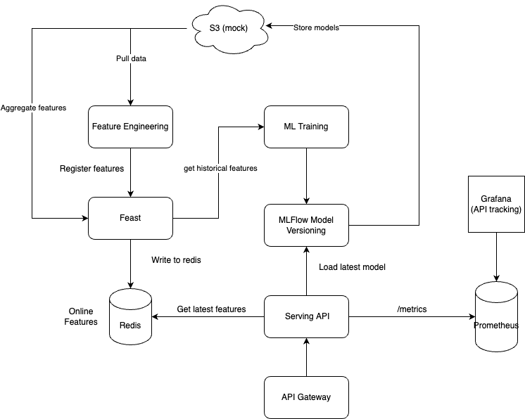

# Introduction
PodFood Demo Prediction is a backend service which predict next quantity by store and product

# Architecture



# Structures

- build:  contains Dockerfile to build service
- src:
  - python:
    - webserver: Online Serving API
    - notebook: Modelling and Data Exploration
- docker-compose.yaml

# How-to-use

## Download file

Get the data from [here](https://drive.google.com/file/d/1daYnIM5MSdRueZf7HvqSRA8VjijxT3JY/view)

## Install environment

- Create conda environment

```bash
conda create -n podfood python=3.8
conda activate podfood
```

- Install AWS CLI (MacOS)

``` bash
brew install awscli
```

## Start backend services

```bash
docker compose up
```

## Data Exploration and Modelling
Before do ETL, we need to upload files to S3 bucket

```bash
aws configure --profile podfood
export AWS_PROFILE=podfood
aws --endpoint-url http://0.0.0.0:4566 s3 mb s3://mlflow
aws --endpoint-url http://0.0.0.0:4566 s3 sync data s3://mlflow/data
```

Execute all cells in the notebook. When the notebook finished, model will be stored in MLFlow so API can be ready to serve

```bash
cd src/python/notebook && juypyter lab
```

## Do some CURLS

```bash
curl -X 'POST' \
  'http://localhost:8000/api/v1/ml/forecast' \
  -H 'accept: application/json' \
  -H 'Content-Type: application/json' \
  -d '{
  "requests": [
    {
      "store_id": 10,
      "product_id": 2071
    }
  ],
  "model_version": "latest",
  "predicted_date": "string"
}'
```

## Monitoring

Grafana and Prometheus are already integrated with Serving API. Follow the instructions to create dashboard

- Go to `localhost:3000`
- Login with `admin|pass@123`
- Create datasource Prometheus with link `http://prometheus:9090`
- Create new dashboard by `Import`. Get the template in `build/grafana/dashboards/fastapi-dashboard.json`


## Comments

- I cannot install Tensorflow data validation on Mac M1 Chip so I will skip the part of checking data drift and come back later.
- ETL part should be done with Airflow K8S Operator, Submit Spark Job to transform data and feature engineering but it takes time for me to bring up those system
  - GitSync to sync DAG to master
  - Build Pyspark Image